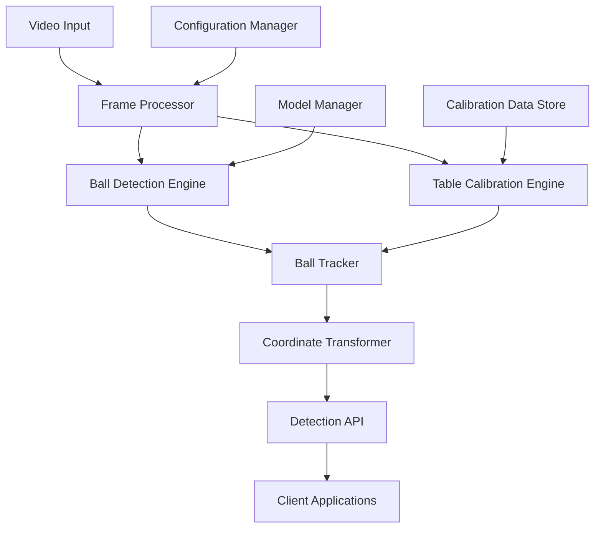

# Design Document - Ball Detection and Table Calibration

## Overview

The ball detection and table calibration system serves as the foundational computer vision component for snooker video analytics. It combines YOLO-based object detection with geometric calibration to provide accurate ball tracking and position mapping. The system is designed to handle both real-time video streams and recorded video files while maintaining high accuracy across varying lighting conditions and camera angles.

## Architecture

### High-Level Architecture



### Component Breakdown

1. **Video Input Handler**: Manages different video sources (live streams, files)
2. **Frame Processor**: Coordinates frame-by-frame analysis
3. **Ball Detection Engine**: YOLO-based ball detection and classification
4. **Table Calibration Engine**: Geometric analysis and homography calculation
5. **Ball Tracker**: Multi-object tracking with DeepSORT/Kalman filters
6. **Coordinate Transformer**: Converts pixel coordinates to table coordinates
7. **Detection API**: Provides standardized interface for detection results

## Components and Interfaces

### 1. Ball Detection Engine

**Purpose**: Detect and classify snooker balls using trained YOLO model

**Key Classes**:
```python
class BallDetectionEngine:
    def __init__(self, model_path: str, confidence_threshold: float = 0.2)
    def detect_balls(self, frame: np.ndarray) -> List[Detection]
    def load_model(self, model_path: str) -> bool
    def set_confidence_threshold(self, threshold: float) -> None

class Detection:
    def __init__(self, bbox: BoundingBox, class_id: int, confidence: float)
    def get_centroid(self) -> Tuple[int, int]
    def get_ball_type(self) -> str
```

**Interfaces**:
- Input: Video frames (numpy arrays)
- Output: List of Detection objects with bounding boxes, classifications, and confidence scores
- Configuration: Model path, confidence thresholds, class mappings

### 2. Table Calibration Engine

**Purpose**: Detect table geometry and establish coordinate transformation

**Key Classes**:
```python
class TableCalibrationEngine:
    def __init__(self, table_dimensions: Tuple[float, float])
    def detect_table_corners(self, frame: np.ndarray) -> List[Point]
    def calculate_homography(self, corners: List[Point]) -> np.ndarray
    def is_calibrated(self) -> bool
    def get_transformation_matrix(self) -> np.ndarray

class TableGeometry:
    def __init__(self, corners: List[Point], dimensions: Tuple[float, float])
    def get_pocket_regions(self) -> List[Region]
    def is_point_on_table(self, point: Point) -> bool
```

**Calibration Strategy**:
1. **Edge Detection**: Use Canny edge detection to find table boundaries
2. **Line Detection**: Apply Hough transform to identify table edges
3. **Corner Detection**: Find intersection points of detected lines
4. **Homography Calculation**: Compute perspective transformation matrix
5. **Validation**: Verify calibration accuracy using known table dimensions

### 3. Ball Tracker

**Purpose**: Maintain consistent tracking of balls across frames

**Key Classes**:
```python
class BallTracker:
    def __init__(self, max_disappeared: int = 10, max_distance: float = 50)
    def update(self, detections: List[Detection]) -> List[TrackedBall]
    def get_active_tracks(self) -> List[TrackedBall]
    def reset_tracking(self) -> None

class TrackedBall:
    def __init__(self, track_id: int, detection: Detection)
    def update_position(self, detection: Detection) -> None
    def predict_next_position(self) -> Point
    def get_trajectory(self) -> List[Point]
    def is_lost(self) -> bool
```

**Tracking Algorithm**:
1. **Association**: Match detections to existing tracks using Hungarian algorithm
2. **Prediction**: Use Kalman filter for position prediction
3. **Update**: Update track states with new detections
4. **Management**: Handle track creation, deletion, and recovery

### 4. Coordinate Transformer

**Purpose**: Convert between pixel and real-world coordinates

**Key Classes**:
```python
class CoordinateTransformer:
    def __init__(self, homography_matrix: np.ndarray, table_dimensions: Tuple[float, float])
    def pixel_to_table(self, pixel_point: Point) -> Point
    def table_to_pixel(self, table_point: Point) -> Point
    def transform_trajectory(self, pixel_trajectory: List[Point]) -> List[Point]
```

## Data Models

### Core Data Structures

```python
@dataclass
class Point:
    x: float
    y: float

@dataclass
class BoundingBox:
    x1: int
    y1: int
    x2: int
    y2: int
    
    def get_center(self) -> Point:
        return Point((self.x1 + self.x2) / 2, (self.y1 + self.y2) / 2)

@dataclass
class Detection:
    bbox: BoundingBox
    class_id: int
    confidence: float
    timestamp: float
    
@dataclass
class TrackedBall:
    track_id: int
    ball_type: str
    current_position: Point
    trajectory: List[Point]
    confidence_history: List[float]
    last_seen_frame: int
    is_active: bool

@dataclass
class CalibrationData:
    homography_matrix: np.ndarray
    table_corners: List[Point]
    table_dimensions: Tuple[float, float]
    pocket_regions: List[BoundingBox]
    calibration_timestamp: float
    is_valid: bool

@dataclass
class FrameAnalysis:
    frame_number: int
    timestamp: float
    detections: List[Detection]
    tracked_balls: List[TrackedBall]
    calibration_data: CalibrationData
    processing_time: float
```

### Configuration Schema

```python
@dataclass
class DetectionConfig:
    model_path: str
    confidence_threshold: float = 0.2
    nms_threshold: float = 0.5
    input_size: Tuple[int, int] = (640, 640)
    
@dataclass
class TrackingConfig:
    max_disappeared_frames: int = 10
    max_tracking_distance: float = 50.0
    kalman_process_noise: float = 0.1
    kalman_measurement_noise: float = 0.1
    
@dataclass
class CalibrationConfig:
    table_length: float = 3.569  # meters
    table_width: float = 1.778   # meters
    auto_recalibrate: bool = True
    calibration_interval: int = 100  # frames
```

## Error Handling

### Error Categories and Strategies

1. **Model Loading Errors**
   - Fallback to pre-trained YOLOv8 model if custom model fails
   - Graceful degradation with warning messages
   - Retry mechanism for network-based model loading

2. **Detection Failures**
   - Continue processing with empty detection list
   - Log detection confidence statistics
   - Provide diagnostic information for troubleshooting

3. **Calibration Failures**
   - Use previous calibration data as fallback
   - Attempt recalibration on next suitable frame
   - Manual calibration override capability

4. **Tracking Failures**
   - Reinitialize tracking using current detections
   - Maintain track history for recovery attempts
   - Confidence-based track validation

### Error Recovery Mechanisms

```python
class ErrorHandler:
    def handle_detection_error(self, error: Exception, frame: np.ndarray) -> List[Detection]:
        # Log error and return empty detection list
        
    def handle_calibration_error(self, error: Exception) -> CalibrationData:
        # Return cached calibration or default values
        
    def handle_tracking_error(self, error: Exception, detections: List[Detection]) -> List[TrackedBall]:
        # Reset tracking and reinitialize with current detections
```

## Testing Strategy

### Unit Testing

1. **Detection Engine Tests**
   - Test ball detection accuracy with known test images
   - Validate classification correctness for each ball type
   - Test confidence threshold behavior

2. **Calibration Engine Tests**
   - Test corner detection with synthetic table images
   - Validate homography calculation accuracy
   - Test coordinate transformation precision

3. **Tracking Tests**
   - Test track association with simulated ball movements
   - Validate trajectory prediction accuracy
   - Test track recovery after occlusion

### Integration Testing

1. **End-to-End Pipeline Tests**
   - Process complete video sequences with known ground truth
   - Validate detection-to-tracking data flow
   - Test calibration persistence across frames

2. **Performance Testing**
   - Measure processing speed for different video resolutions
   - Test memory usage with long video sequences
   - Validate real-time processing capabilities

### Test Data Requirements

1. **Synthetic Test Data**
   - Computer-generated snooker table images with known ball positions
   - Varying lighting conditions and camera angles
   - Controlled ball movements and trajectories

2. **Real Video Test Data**
   - Annotated snooker video clips with ground truth ball positions
   - Different table setups and lighting conditions
   - Various camera angles and video qualities

### Validation Metrics

1. **Detection Metrics**
   - Precision, Recall, F1-score for ball detection
   - Mean Average Precision (mAP) for classification
   - Detection consistency across frames

2. **Calibration Metrics**
   - Reprojection error for homography accuracy
   - Coordinate transformation precision
   - Table dimension estimation accuracy

3. **Tracking Metrics**
   - Multiple Object Tracking Accuracy (MOTA)
   - Track fragmentation rate
   - Identity switch frequency

## Performance Considerations

### Optimization Strategies

1. **Model Optimization**
   - Use TensorRT or ONNX for model acceleration
   - Implement dynamic batch sizing for efficiency
   - Consider model quantization for edge deployment

2. **Processing Optimization**
   - Frame skipping for non-critical analysis
   - Region of Interest (ROI) processing
   - Multi-threading for parallel processing

3. **Memory Management**
   - Efficient frame buffering strategies
   - Trajectory data compression
   - Garbage collection optimization

### Scalability Considerations

1. **Multi-Camera Support**
   - Independent processing pipelines per camera
   - Synchronized analysis across multiple views
   - Camera calibration data management

2. **Cloud Deployment**
   - Containerized deployment with Docker
   - GPU resource allocation and management
   - Horizontal scaling for multiple video streams