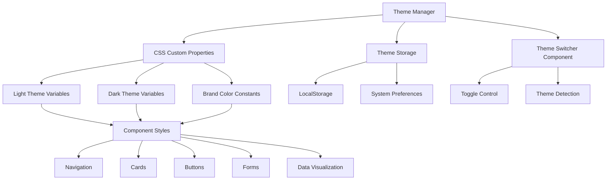

# Design Document

## Overview

The UI Theming System will transform the current snooker analysis web application into a brand-compliant, accessible, and engaging platform that strictly adheres to the defined color palette and sports-inspired philosophy. The system will replace the existing ad-hoc styling approach with a structured, maintainable theming architecture that supports both light and dark modes while maintaining the energetic, playful, and motivating tone.

The design leverages CSS custom properties, JavaScript theme management, and component-based styling to create a cohesive user experience that reflects the competitive spirit of snooker while ensuring accessibility and scalability.

## Architecture

### Theme Management Architecture



### File Structure

```
static/
├── css/
│   ├── themes/
│   │   ├── brand-colors.css          # Brand color definitions
│   │   ├── light-theme.css           # Light theme variables
│   │   ├── dark-theme.css            # Dark theme variables
│   │   └── theme-components.css      # Theme-aware components
│   ├── components/
│   │   ├── navigation.css            # Navigation styling
│   │   ├── cards.css                 # Card components
│   │   ├── buttons.css               # Button variations
│   │   ├── forms.css                 # Form elements
│   │   └── data-viz.css              # Data visualization
│   └── main.css                      # Main stylesheet orchestrator
├── js/
│   ├── theme-manager.js              # Core theme management
│   ├── theme-switcher.js             # Theme toggle component
│   └── accessibility-enhancer.js    # Accessibility features
└── assets/
    ├── logos/
    │   ├── logo-light.svg            # Light theme logo
    │   ├── logo-dark.svg             # Dark theme logo
    │   └── logo-variants.svg         # Additional logo variants
    └── icons/
        └── theme-icons.svg           # Theme-related icons
```

## Components and Interfaces

### 1. Theme Manager (JavaScript)

**Purpose:** Central theme management system that handles theme switching, persistence, and system preference detection.

**Interface:**
```javascript
class ThemeManager {
    constructor(options = {})
    getCurrentTheme(): string
    setTheme(themeName: string): void
    toggleTheme(): void
    detectSystemPreference(): string
    persistTheme(themeName: string): void
    loadPersistedTheme(): string
    applyTheme(themeName: string): void
    validateBrandCompliance(): boolean
}
```

**Key Features:**
- Automatic system preference detection
- Theme persistence in localStorage
- Brand compliance validation
- Accessibility preference handling
- Event-driven theme changes

### 2. Brand Color System (CSS)

**Purpose:** Centralized brand color definitions that ensure strict adherence to the approved palette.

**Color Definitions:**
```css
:root {
    /* Primary Brand Colors */
    --brand-blue-primary: #0B405B;
    --brand-green-secondary: #94D82A;
    
    /* Brand Color Variations */
    --brand-blue-light: #1a5a7a;
    --brand-blue-dark: #062a3d;
    --brand-green-light: #a8e042;
    --brand-green-dark: #7bc220;
    
    /* Neutral Palette (Derived) */
    --neutral-50: #f8fafc;
    --neutral-100: #f1f5f9;
    --neutral-200: #e2e8f0;
    --neutral-300: #cbd5e1;
    --neutral-400: #94a3b8;
    --neutral-500: #64748b;
    --neutral-600: #475569;
    --neutral-700: #334155;
    --neutral-800: #1e293b;
    --neutral-900: #0f172a;
}
```

### 3. Theme Switcher Component

**Purpose:** User interface component for theme selection with accessibility features.

**HTML Structure:**
```html
<div class="theme-switcher" role="radiogroup" aria-label="Theme selection">
    <button class="theme-option" data-theme="light" role="radio" aria-checked="false">
        <i class="icon-sun" aria-hidden="true"></i>
        <span>Light</span>
    </button>
    <button class="theme-option" data-theme="dark" role="radio" aria-checked="true">
        <i class="icon-moon" aria-hidden="true"></i>
        <span>Dark</span>
    </button>
    <button class="theme-option" data-theme="auto" role="radio" aria-checked="false">
        <i class="icon-auto" aria-hidden="true"></i>
        <span>Auto</span>
    </button>
</div>
```

### 4. Component Theming System

**Purpose:** Standardized theming approach for all UI components using CSS custom properties.

**Component Pattern:**
```css
.component-name {
    background-color: var(--component-bg);
    color: var(--component-text);
    border-color: var(--component-border);
    transition: all var(--transition-smooth);
}

.component-name:hover {
    background-color: var(--component-bg-hover);
    transform: var(--component-hover-transform);
}

.component-name:focus {
    outline: var(--focus-outline);
    box-shadow: var(--focus-shadow);
}
```

## Data Models

### Theme Configuration Model

```typescript
interface ThemeConfig {
    name: string;
    displayName: string;
    colors: {
        primary: string;
        secondary: string;
        background: string;
        surface: string;
        text: {
            primary: string;
            secondary: string;
            accent: string;
        };
        status: {
            success: string;
            warning: string;
            error: string;
            info: string;
        };
    };
    typography: {
        fontFamily: string;
        fontSizes: Record<string, string>;
        fontWeights: Record<string, number>;
    };
    spacing: Record<string, string>;
    borderRadius: Record<string, string>;
    shadows: Record<string, string>;
    transitions: Record<string, string>;
}
```

### Brand Compliance Model

```typescript
interface BrandCompliance {
    colorPalette: {
        approved: string[];
        violations: string[];
    };
    logoUsage: {
        variant: 'light' | 'dark' | 'color';
        size: 'small' | 'medium' | 'large';
        placement: string;
    };
    typography: {
        approved: boolean;
        violations: string[];
    };
    accessibility: {
        contrastRatios: Record<string, number>;
        wcagCompliance: 'AA' | 'AAA';
    };
}
```

### User Preferences Model

```typescript
interface UserPreferences {
    theme: 'light' | 'dark' | 'auto';
    reducedMotion: boolean;
    highContrast: boolean;
    fontSize: 'small' | 'medium' | 'large';
    colorBlindnessSupport: boolean;
    lastUpdated: Date;
}
```

## Error Handling

### Theme Loading Errors

**Scenario:** Theme files fail to load or contain invalid CSS
**Handling:**
1. Fallback to default theme
2. Log error to console with detailed information
3. Display user-friendly notification
4. Attempt to reload theme after network recovery

```javascript
class ThemeErrorHandler {
    handleThemeLoadError(error, themeName) {
        console.error(`Failed to load theme: ${themeName}`, error);
        this.fallbackToDefault();
        this.notifyUser('Theme loading failed, using default theme');
        this.scheduleRetry(themeName);
    }
    
    validateThemeIntegrity(themeData) {
        const requiredProperties = ['colors', 'typography', 'spacing'];
        return requiredProperties.every(prop => prop in themeData);
    }
}
```

### Brand Compliance Violations

**Scenario:** Non-approved colors or styling detected
**Handling:**
1. Log compliance violations
2. Provide developer warnings in development mode
3. Auto-correct minor violations where possible
4. Generate compliance report

```javascript
class BrandComplianceValidator {
    validateColorUsage(cssRules) {
        const violations = [];
        const approvedColors = ['#0B405B', '#94D82A'];
        
        cssRules.forEach(rule => {
            const colors = this.extractColors(rule);
            colors.forEach(color => {
                if (!this.isApprovedColor(color, approvedColors)) {
                    violations.push({
                        rule: rule.selectorText,
                        color: color,
                        suggestion: this.suggestApprovedColor(color)
                    });
                }
            });
        });
        
        return violations;
    }
}
```

### Accessibility Failures

**Scenario:** Contrast ratios or accessibility features fail
**Handling:**
1. Automatically enhance contrast when possible
2. Provide alternative text/icon combinations
3. Ensure keyboard navigation remains functional
4. Graceful degradation for unsupported features

## Testing Strategy

### 1. Visual Regression Testing

**Approach:** Automated screenshot comparison across themes and devices
**Tools:** Playwright, Percy, or similar visual testing tools
**Coverage:**
- All major components in both light and dark themes
- Responsive breakpoints (mobile, tablet, desktop)
- High contrast mode variations
- Logo and brand asset rendering

**Test Structure:**
```javascript
describe('Theme Visual Regression', () => {
    ['light', 'dark'].forEach(theme => {
        test(`${theme} theme renders correctly`, async ({ page }) => {
            await page.goto('/');
            await page.evaluate(theme => {
                window.themeManager.setTheme(theme);
            }, theme);
            await expect(page).toHaveScreenshot(`homepage-${theme}.png`);
        });
    });
});
```

### 2. Brand Compliance Testing

**Approach:** Automated validation of color usage and brand guidelines
**Implementation:**
```javascript
describe('Brand Compliance', () => {
    test('only approved colors are used', async () => {
        const cssRules = await extractCSSRules();
        const violations = brandValidator.validateColorUsage(cssRules);
        expect(violations).toHaveLength(0);
    });
    
    test('logo variants are correctly applied', async ({ page }) => {
        await page.goto('/');
        const lightLogo = await page.locator('[data-theme="light"] .logo');
        const darkLogo = await page.locator('[data-theme="dark"] .logo');
        
        expect(await lightLogo.getAttribute('src')).toContain('logo-light');
        expect(await darkLogo.getAttribute('src')).toContain('logo-dark');
    });
});
```

### 3. Accessibility Testing

**Approach:** Automated and manual accessibility validation
**Tools:** axe-core, WAVE, manual keyboard testing
**Coverage:**
- Color contrast ratios (WCAG AA compliance)
- Keyboard navigation functionality
- Screen reader compatibility
- Focus management during theme switches
- High contrast mode support

**Test Implementation:**
```javascript
describe('Accessibility', () => {
    test('meets WCAG AA contrast requirements', async ({ page }) => {
        await page.goto('/');
        const results = await injectAxe(page);
        expect(results.violations.filter(v => v.id === 'color-contrast')).toHaveLength(0);
    });
    
    test('theme switcher is keyboard accessible', async ({ page }) => {
        await page.goto('/');
        await page.keyboard.press('Tab'); // Navigate to theme switcher
        await page.keyboard.press('Enter'); // Activate
        await page.keyboard.press('ArrowRight'); // Select next theme
        await page.keyboard.press('Enter'); // Confirm selection
        
        const activeTheme = await page.evaluate(() => window.themeManager.getCurrentTheme());
        expect(activeTheme).toBe('dark');
    });
});
```

### 4. Performance Testing

**Approach:** Measure theme switching performance and CSS loading times
**Metrics:**
- Theme switch duration (target: <100ms)
- CSS file load times
- Runtime performance impact
- Memory usage during theme changes

**Test Implementation:**
```javascript
describe('Performance', () => {
    test('theme switching is performant', async ({ page }) => {
        await page.goto('/');
        
        const startTime = Date.now();
        await page.evaluate(() => window.themeManager.toggleTheme());
        await page.waitForFunction(() => document.body.classList.contains('theme-transition-complete'));
        const endTime = Date.now();
        
        expect(endTime - startTime).toBeLessThan(100);
    });
});
```

### 5. Cross-Browser Testing

**Approach:** Ensure consistent theming across all supported browsers
**Coverage:**
- Chrome, Firefox, Safari, Edge
- Mobile browsers (iOS Safari, Chrome Mobile)
- CSS custom property support
- JavaScript theme management functionality

### 6. Integration Testing

**Approach:** Test theme system integration with existing application features
**Scenarios:**
- Theme persistence across page navigation
- Theme application during video analysis
- Theme compatibility with data visualizations
- Theme behavior during file uploads and processing

**Test Structure:**
```javascript
describe('Theme Integration', () => {
    test('theme persists during video analysis', async ({ page }) => {
        await page.goto('/');
        await page.evaluate(() => window.themeManager.setTheme('dark'));
        
        // Upload and analyze video
        await page.goto('/upload');
        await uploadTestVideo(page);
        await page.waitForSelector('.analysis-results');
        
        const currentTheme = await page.evaluate(() => window.themeManager.getCurrentTheme());
        expect(currentTheme).toBe('dark');
    });
});
```

This comprehensive testing strategy ensures that the theming system maintains brand compliance, accessibility standards, and performance requirements while providing a consistent user experience across all platforms and use cases.